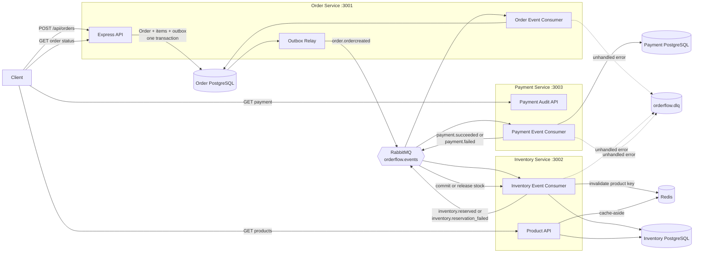
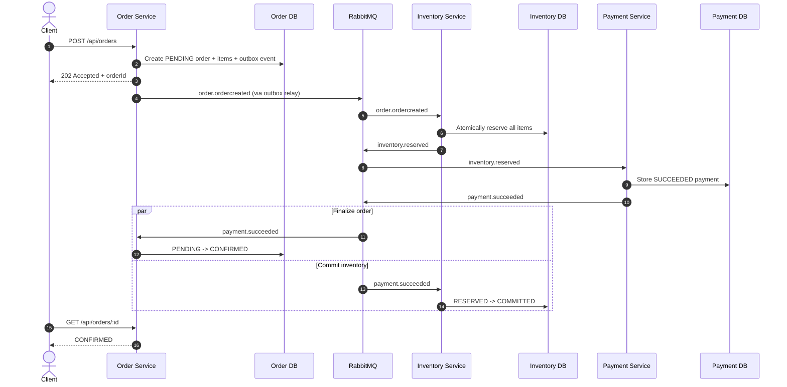

# OrderFlow E-Commerce Saga

OrderFlow is a small event-driven e-commerce backend that demonstrates how to coordinate an order across independent **Order**, **Inventory**, and **Payment** services without a distributed database transaction.

The project uses:

- Node.js and Express for HTTP APIs
- PostgreSQL and Prisma for service-owned data
- RabbitMQ for asynchronous events
- Redis for product-detail caching
- A choreography-based Saga for the checkout workflow
- A transactional outbox for reliable creation of the first order event
- Idempotent consumers and a dead-letter queue for message safety

> This repository is an educational reference implementation. Read [Current limitations](#current-limitations) before treating it as production-ready.

For a code-mapped view of every component, event, state transition, success path, compensation path, cache path, and DLQ path, see **[Architecture and Saga Flows](./docs/ARCHITECTURE.md)**.

## Table of contents

- [System architecture](#system-architecture)
- [Service responsibilities](#service-responsibilities)
- [Checkout flow](#checkout-flow)
- [Patterns demonstrated](#patterns-demonstrated)
- [Project structure](#project-structure)
- [Prerequisites](#prerequisites)
- [Quick start](#quick-start)
- [API reference](#api-reference)
- [Testing the Saga](#testing-the-saga)
- [Observability and failure handling](#observability-and-failure-handling)
- [Useful commands](#useful-commands)
- [Troubleshooting](#troubleshooting)
- [Current limitations](#current-limitations)

## System architecture

The system is split into three independently runnable services. External clients use HTTP, while services communicate asynchronously through the `orderflow.events` RabbitMQ topic exchange.



### Internal service layers

Most requests and events follow this lightweight layered structure:

```text
app.js / route registration
        |
        +--> HTTP controller --------+
        |                            |
        +--> RabbitMQ consumer ------+--> service --> Prisma / Redis
```

This is pragmatic layering rather than strict Clean Architecture: concrete Prisma, Redis, and RabbitMQ clients are imported directly, and no repository interfaces or dependency-injection container are used.

## Service responsibilities

| Service | Owns | HTTP endpoints | Default port |
| --- | --- | --- | ---: |
| Order | Orders, order items, final order state, outbox events, consumed-event records | Create/read orders, metrics, DLQ inspection, health | `3001` |
| Inventory | Products, available stock, reservations, reservation lifecycle, consumed-event records | Product list/detail and health | `3002` |
| Payment | Payment attempts and consumed-event records | Payment lookup and health | `3003` |

Each service has a separate Prisma schema and `DATABASE_URL`. There are no database joins or foreign keys across service boundaries. Services communicate using IDs and event payloads.

## Checkout flow

### Event topology

| Routing key | Publisher | Bound consumer queue(s) | Purpose |
| --- | --- | --- | --- |
| `order.ordercreated` | Order outbox relay | `inventory_service_queue` | Begin stock reservation |
| `inventory.reserved` | Inventory | `payment_service_queue` | Stock is held; begin payment |
| `inventory.reservation_failed` | Inventory | `order_service_queue` | Mark the order as failed |
| `payment.succeeded` | Payment | `order_service_queue`, `inventory_service_queue` | Confirm the order and commit stock |
| `payment.failed` | Payment | `order_service_queue`, `inventory_service_queue` | Fail the order and release stock |
| `inventory.released` | Inventory | No in-repository binding | Compensation notification for future consumers |

### Successful checkout



The initial request returns `202 Accepted` because inventory and payment finish asynchronously. Clients should poll `GET /api/orders/:id` until the order becomes `CONFIRMED` or `FAILED`.

### Inventory failure

```text
OrderCreated
  -> inventory cannot reserve every item
  -> the complete reservation transaction rolls back
  -> inventory.reservation_failed
  -> order becomes FAILED
  -> payment is not attempted
```

### Payment failure and compensation

```text
inventory.reserved
  -> payment fails
  -> payment.failed
       |-> order becomes FAILED
       +-> inventory releases the reservation
```

Inventory uses separate `stockTotal` and `stockReserved` values:

```text
Initial:    total=10, reserved=0, available=10
Reserved:   total=10, reserved=2, available=8
Committed:  total=8,  reserved=0, available=8
Released:   total=10, reserved=0, available=10
```

## Patterns demonstrated

### Event-driven microservices

Services own different business capabilities and exchange events instead of calling one another synchronously. This reduces temporal coupling and allows RabbitMQ to fan one event out to multiple consumers.

### Choreography-based Saga

There is no central Saga coordinator. Inventory reacts to `OrderCreated`; Payment reacts to `InventoryReserved`; Order and Inventory react to the payment outcome.

### Compensating transaction

When payment fails, the system cannot roll back a transaction across three databases. Inventory instead runs `releaseStock()`, an explicit business action that reverses the earlier reservation.

### Transactional outbox

Order and `OutboxEvent` are created in the same PostgreSQL transaction. An order therefore cannot commit without the initial event also being recorded. A background worker publishes pending events to RabbitMQ.

### Idempotent consumer / inbox table

Every service stores processed RabbitMQ `messageId` values in a `ProcessedEvent` table. A redelivered message can be recognized and acknowledged without intentionally repeating the operation.

### Cache-aside

`GET /api/products/:id` checks Redis first. A miss falls back to PostgreSQL and caches the result for 300 seconds. Reservation, commit, and release operations invalidate affected product keys. Redis errors fail open to PostgreSQL.

### Atomic stock reservation

Inventory reserves stock with one conditional PostgreSQL update:

```sql
UPDATE products
SET stock_reserved = stock_reserved + :quantity
WHERE id = :productId
  AND (stock_total - stock_reserved) >= :quantity
RETURNING *;
```

The availability check and update happen atomically, preventing a read-then-write race that could oversell stock.

### Dead-letter queue

An unhandled consumer exception rejects the message without requeueing it. RabbitMQ sends it through `orderflow.dlx` to the shared `orderflow.dlq` for inspection.

### Correlation IDs

The Order service accepts `x-correlation-id` or generates one. It is stored with the outbox event and propagated through RabbitMQ headers, making one checkout traceable across asynchronous service logs.

## Project structure

```text
ecom/
|-- README.md
|-- docs/
|   +-- ARCHITECTURE.md
|-- order-service/
|   |-- prisma/
|   |   |-- migrations/
|   |   `-- schema.prisma
|   `-- src/
|       |-- config/rabbitmq.js
|       |-- consumers/orderConsumer.js
|       |-- controllers/orderController.js
|       |-- services/orderService.js
|       |-- utils/
|       |-- workers/outboxRelay.js
|       `-- app.js
|-- inventory-service/
|   |-- prisma/
|   |   |-- migrations/
|   |   |-- schema.prisma
|   |   `-- seed.js
|   `-- src/
|       |-- cache/productCache.js
|       |-- config/
|       |-- consumers/inventoryConsumer.js
|       |-- controllers/productController.js
|       |-- services/inventoryService.js
|       `-- app.js
`-- payment-service/
    |-- prisma/
    |   |-- migrations/
    |   `-- schema.prisma
    `-- src/
        |-- config/rabbitmq.js
        |-- consumers/paymentConsumer.js
        |-- services/paymentService.js
        `-- app.js
```

## Prerequisites

- Node.js `20` or newer; Node.js 22 LTS is recommended
- npm
- PostgreSQL
- RabbitMQ
- Redis
- Optional: Docker, for starting local infrastructure quickly

The commands below assume you are in the repository root.

## Quick start

### 1. Clone and install dependencies

```bash
git clone https://github.com/inductionotg/ecom.git
cd ecom

npm --prefix order-service ci
npm --prefix inventory-service ci
npm --prefix payment-service ci
```

### 2. Start local infrastructure

If PostgreSQL, RabbitMQ, and Redis are already available, skip this step and use their connection URLs in the environment files.

```bash
docker run -d --name orderflow-postgres -e POSTGRES_USER=postgres -e POSTGRES_PASSWORD=postgres -e POSTGRES_DB=orderflow -p 5432:5432 postgres:16-alpine
docker run -d --name orderflow-rabbitmq -p 5672:5672 -p 15672:15672 rabbitmq:3-management
docker run -d --name orderflow-redis -p 6379:6379 redis:7-alpine
docker exec orderflow-postgres psql -U postgres -d orderflow -c "CREATE SCHEMA IF NOT EXISTS inventory_schema; CREATE SCHEMA IF NOT EXISTS payment_schema;"
```

RabbitMQ's management UI will be available at <http://localhost:15672> with the local default credentials `guest` / `guest`.

### 3. Create environment files

Copy each checked-in example:

```powershell
Copy-Item order-service/.env.example order-service/.env
Copy-Item inventory-service/.env.example inventory-service/.env
Copy-Item payment-service/.env.example payment-service/.env
```

On macOS or Linux:

```bash
cp order-service/.env.example order-service/.env
cp inventory-service/.env.example inventory-service/.env
cp payment-service/.env.example payment-service/.env
```

The examples target the local Docker containers above. Update the URLs if you use managed infrastructure. Never commit real `.env` files.

### 4. Generate Prisma clients and apply migrations

```bash
cd order-service
npx prisma generate
npx prisma migrate deploy

cd ../inventory-service
npx prisma generate
npx prisma migrate deploy
node prisma/seed.js

cd ../payment-service
npx prisma generate
npx prisma migrate deploy

cd ..
```

The seed creates:

| ID | Product | Price | Initial stock |
| --- | --- | ---: | ---: |
| `prod_laptop_01` | MacBook Pro 16&quot; | `1200.00` | `10` |
| `prod_mouse_02` | Wireless Magic Mouse | `25.00` | `2` |

### 5. Start all services

Open three terminals. Start Payment first, Inventory second, and Order last so all RabbitMQ queues and bindings exist before the outbox begins publishing. This order is especially important if durable queues contain messages from an earlier run.

Terminal 1:

```bash
cd payment-service
npm run dev
```

Terminal 2:

```bash
cd inventory-service
npm run dev
```

Terminal 3:

```bash
cd order-service
npm run dev
```

Wait until all three services report that RabbitMQ is connected before submitting an order.

For non-development execution, replace `npm run dev` with `npm start`.

### 6. Verify health

```bash
curl http://localhost:3001/health
curl http://localhost:3002/health
curl http://localhost:3003/health
```

Expected responses:

```json
{ "status": "UP", "service": "order-service" }
```

> Health endpoints currently report process health only; they do not actively verify PostgreSQL, RabbitMQ, or Redis.

## API reference

### Order service — `http://localhost:3001`

| Method | Path | Description |
| --- | --- | --- |
| `POST` | `/api/orders` | Accept an order and return `202` with a `PENDING` state |
| `GET` | `/api/orders/:id` | Return the current order and its items |
| `GET` | `/api/admin/metrics` | Group order count and revenue by status |
| `GET` | `/api/admin/dlq` | Peek at up to ten dead-lettered messages without intentionally deleting them |
| `GET` | `/health` | Service health |

Create an order:

```bash
curl -i -X POST http://localhost:3001/api/orders \
  -H "Content-Type: application/json" \
  -H "X-Correlation-Id: checkout-demo-001" \
  -d '{
    "userId": "user-42",
    "items": [
      { "productId": "prod_laptop_01", "quantity": 1, "unitPrice": 1200 },
      { "productId": "prod_mouse_02", "quantity": 1, "unitPrice": 25 }
    ]
  }'
```

The response contains an `orderId`. Poll it with:

```bash
curl http://localhost:3001/api/orders/<orderId>
```

### Inventory service — `http://localhost:3002`

| Method | Path | Description |
| --- | --- | --- |
| `GET` | `/api/products` | List products with calculated available stock |
| `GET` | `/api/products/:id` | Return one product using the Redis cache-aside path |
| `GET` | `/health` | Service health |

```bash
curl http://localhost:3002/api/products
curl http://localhost:3002/api/products/prod_laptop_01
```

### Payment service — `http://localhost:3003`

| Method | Path | Description |
| --- | --- | --- |
| `GET` | `/api/payments/:orderId` | Return the payment record for an order |
| `GET` | `/health` | Service health |

```bash
curl http://localhost:3003/api/payments/<orderId>
```

## Testing the Saga

There is currently no automated test suite. The following requests exercise the three main workflow outcomes.

### Successful order

Use one laptop and one mouse for a total of `1225`. The expected final states are:

```text
Order:       CONFIRMED
Payment:     SUCCEEDED
Reservation: COMMITTED
```

### Insufficient inventory

The seed contains only two mice. Request three:

```json
{
  "userId": "user-stock-failure",
  "items": [
    { "productId": "prod_mouse_02", "quantity": 3, "unitPrice": 25 }
  ]
}
```

Expected result: the order becomes `FAILED`, no payment is created, and the reservation transaction leaves no partial holds.

### Payment failure and inventory compensation

The mock gateway rejects totals greater than `5000`. Request five laptops:

```json
{
  "userId": "user-payment-failure",
  "items": [
    { "productId": "prod_laptop_01", "quantity": 5, "unitPrice": 1200 }
  ]
}
```

Expected final states:

```text
Order:       FAILED
Payment:     FAILED
Reservation: RELEASED
```

## Observability and failure handling

### Correlation ID

Send an `X-Correlation-Id` header when creating an order. If it is missing, Order generates a UUID. The response repeats the ID, and downstream event logs include it.

### Structured logs

All services use Pino. Development mode uses human-readable, colorized logs; production mode emits structured JSON.

### Dead-letter queue

Business failures such as insufficient stock and card decline are translated into Saga events and acknowledged normally. Unexpected technical exceptions are rejected to `orderflow.dlq`.

Inspect the queue through:

```bash
curl http://localhost:3001/api/admin/dlq
```

## Useful commands

Run commands inside the relevant service directory unless noted otherwise.

| Command | Purpose |
| --- | --- |
| `npm ci` | Install exact dependencies from `package-lock.json` |
| `npm run dev` | Start with Nodemon |
| `npm start` | Start with Node.js |
| `npx prisma generate` | Generate the Prisma client |
| `npx prisma migrate deploy` | Apply checked-in migrations |
| `npm run prisma:migrate -- --name <name>` | Create/apply a migration during development |
| `npx prisma studio` | Open Prisma's database browser |
| `node prisma/seed.js` | Seed inventory products; Inventory service only |

## Troubleshooting

### `ECONNREFUSED` or RabbitMQ startup failure

Confirm RabbitMQ is running and that `RABBITMQ_URL` is correct. RabbitMQ is a hard startup dependency; a service exits if its initial connection fails.

```bash
docker ps --filter name=orderflow-rabbitmq
```

### Redis errors

Confirm Redis is running and `REDIS_URL` is correct. Product reads fall back to PostgreSQL if Redis is unavailable, but logs will show reconnect attempts.

### Prisma cannot find a table or schema

Check the schema query parameter in each URL:

```text
Order:     ?schema=public
Inventory: ?schema=inventory_schema
Payment:   ?schema=payment_schema
```

Then rerun `npx prisma generate` and `npx prisma migrate deploy` in the affected service.

### Orders remain `PENDING`

Verify all three services were running before the order was created. RabbitMQ topic exchanges do not retain an event for a queue/binding that did not yet exist. Also inspect service logs and `/api/admin/dlq`.

### Port already in use

Change the service's `PORT` environment variable, then use the new port in API requests.

## Current limitations

- The transactional outbox protects only the initial Order event. Inventory and Payment still have database/publish crash windows.
- The relay uses a regular RabbitMQ channel rather than publisher confirms; a successful `publish()` call is not a broker persistence acknowledgement.
- Inventory and Payment do not atomically combine their domain updates with `ProcessedEvent` insertion.
- Unexpected technical errors go directly to the DLQ; no delayed retry/backoff queues are configured.
- Reservations have no expiration or cleanup worker.
- The request supplies `unitPrice`; a real checkout should obtain trusted prices from a catalog or pricing service.
- Payment is a deterministic simulator, not an integration with a payment provider.
- Event payloads and routing keys are duplicated string contracts with no schema versioning.
- There is no API gateway, authentication, authorization, rate limiting, or protection for admin endpoints.
- There are no automated tests, deployment manifests, consumer prefetch limits, graceful shutdown handlers, or broker reconnect logic.
- Order confirmation and inventory commit consume `payment.succeeded` independently, so the order can briefly—or after a technical failure, permanently—disagree with inventory.

This project is not event sourcing, full CQRS, a centrally orchestrated Saga, or exactly-once message processing. It demonstrates eventual consistency with at-least-once-style messaging and best-effort deduplication.

## License

The service package manifests declare the ISC license.
