# OrderFlow Architecture and Saga Flows

This document maps the architecture and flows implemented by the current code. The diagrams are **as-built**, not proposed future behavior.

## 1. System architecture

OrderFlow is an event-driven system with three independently runnable services. Clients use HTTP; the checkout workflow crosses service boundaries through RabbitMQ events.

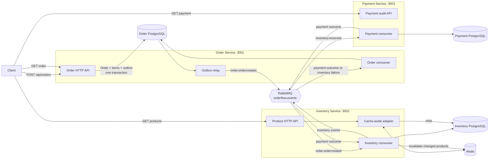

### Service ownership

| Service | Responsibility | Owned models | Background processes |
| --- | --- | --- | --- |
| Order | Accept orders and own final order state | `Order`, `OrderItem`, `OutboxEvent`, `ProcessedEvent` | Outbox relay and order-outcome consumer |
| Inventory | Own products, stock, and reservations | `Product`, `InventoryReservation`, `ProcessedEvent` | Reservation/commit/release consumer |
| Payment | Process and audit payment attempts | `Payment`, `ProcessedEvent` | Payment consumer |

There are no database foreign keys between services. IDs cross boundaries only through event payloads. Internally, each service approximately follows:

```text
app.js -> HTTP controller or RabbitMQ consumer -> service -> Prisma / Redis
```

This is pragmatic layering, not strict Clean Architecture: concrete infrastructure is imported directly and no repository interfaces or dependency-injection container are present.

## 2. RabbitMQ topology and event contracts

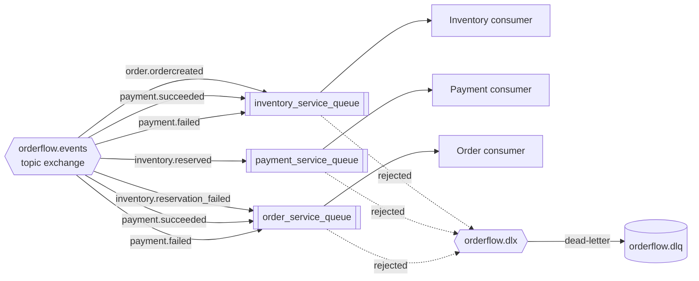

| Routing key | Publisher | Consumer(s) | Payload used by the code |
| --- | --- | --- | --- |
| `order.ordercreated` | Order relay | Inventory | `{ orderId, userId, totalAmount, items[] }` |
| `inventory.reserved` | Inventory | Payment | `{ orderId, totalAmount, status: "RESERVED" }` |
| `inventory.reservation_failed` | Inventory | Order | `{ orderId, reason }` |
| `payment.succeeded` | Payment | Order, Inventory | `{ orderId, paymentId, amount, status: "SUCCEEDED" }` |
| `payment.failed` | Payment | Order, Inventory | `{ orderId, reason, status: "FAILED" }` |
| `inventory.released` | Inventory | No in-repository consumer | `{ orderId, status: "RELEASED" }` |

Messages are persistent JSON. AMQP metadata carries `messageId`, `correlationId`, and `eventType`; Inventory outputs also carry `parentEventId`. There is no shared versioned event schema.

## 3. State transitions

### Order

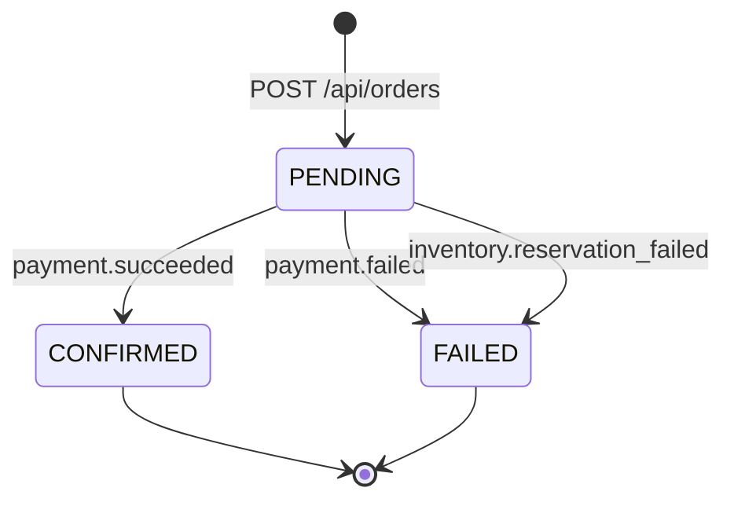

`CANCELLED` exists in the schema but is not used by a current transition.

### Inventory reservation

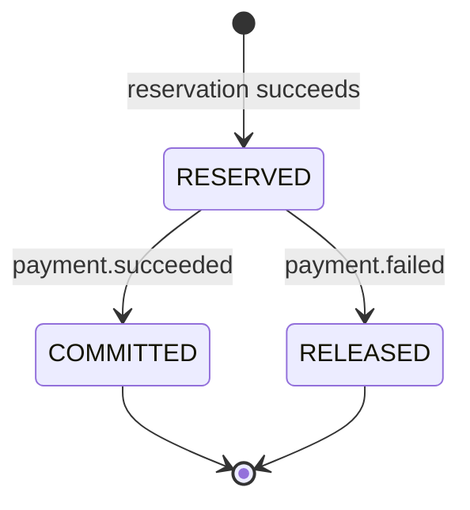

### Payment

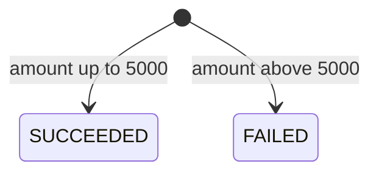

`REFUNDED` exists in the schema, but refund processing is not implemented.

## 4. Successful Saga flow

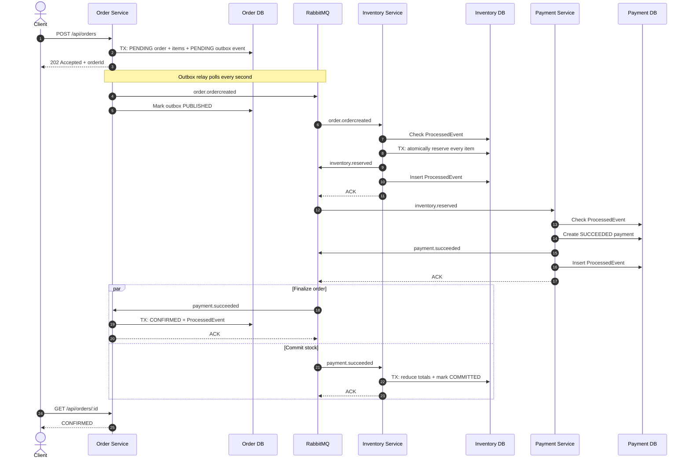

Order confirmation and inventory commit run independently, so temporary disagreement is possible under eventual consistency.

## 5. Inventory-failure flow

All requested items reserve within one local transaction. If one conditional update finds insufficient stock, the entire transaction rolls back.

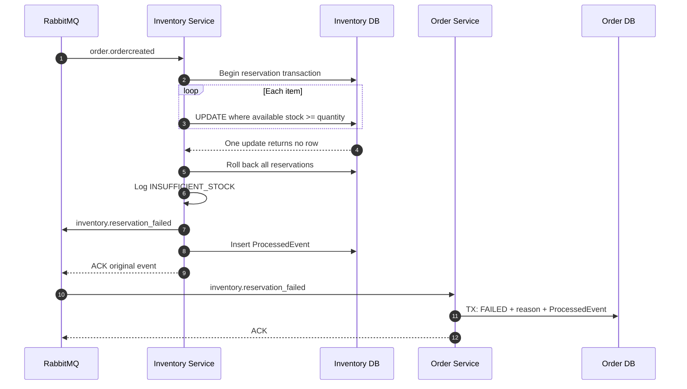

This is an expected business failure and does not go to the DLQ.

## 6. Payment-failure compensation flow

The mock payment fails when the total is greater than `5000`. Inventory then runs the implemented compensating action, `releaseStock()`.

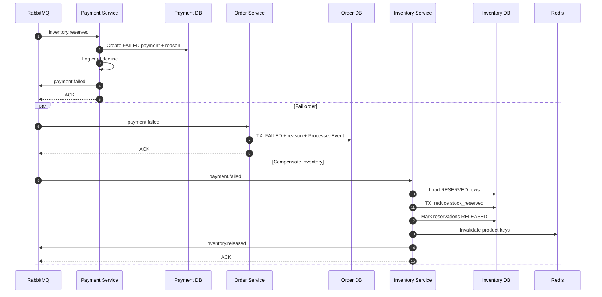

The compensation restores availability by reducing `stock_reserved`; it does not reduce `stock_total`.

## 7. Transactional outbox flow

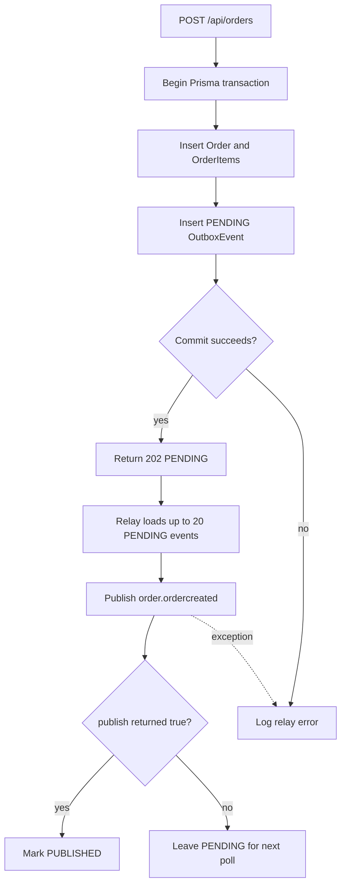

The Order and first outbox record commit atomically. The relay does not use publisher confirms: `publish() === true` means the local buffer accepted the message, not that RabbitMQ persisted it.

## 8. Consumer error, trace, and DLQ flow

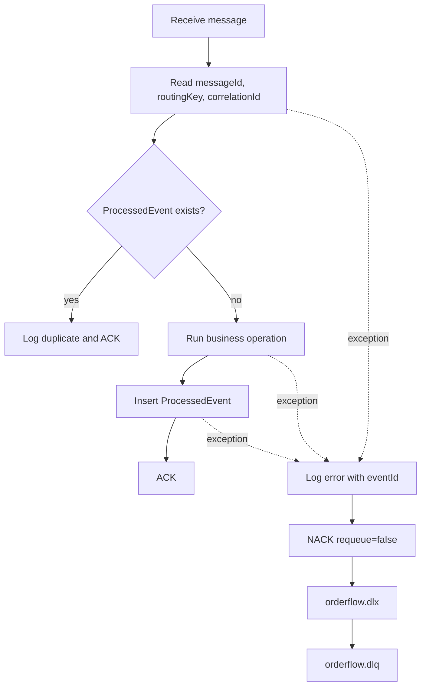

| Failure type | Current behavior |
| --- | --- |
| Insufficient stock | Log warning, emit `inventory.reservation_failed`, ACK |
| Mock card decline | Store/log failure, emit `payment.failed`, ACK |
| Unexpected consumer exception | Log error, NACK, dead-letter |
| Redis GET error | Log error and fall back to PostgreSQL |
| Redis SET/DEL error | Log error and continue |

Order combines its state update and `ProcessedEvent` insert in one transaction. Inventory and Payment perform business work and publish before recording `ProcessedEvent`, leaving crash/duplicate windows.

## 9. Product cache flow

Only `GET /api/products/:id` uses Redis; `GET /api/products` reads PostgreSQL directly.

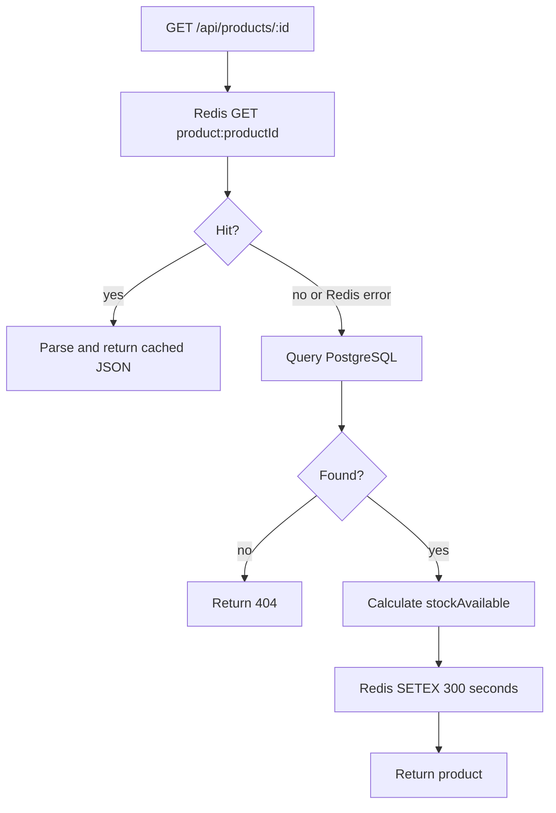

Reservation, commit, and release operations invalidate affected product keys.

## 10. Safe startup flow

Queues and bindings are created during service startup. Start consumers before Order can publish:

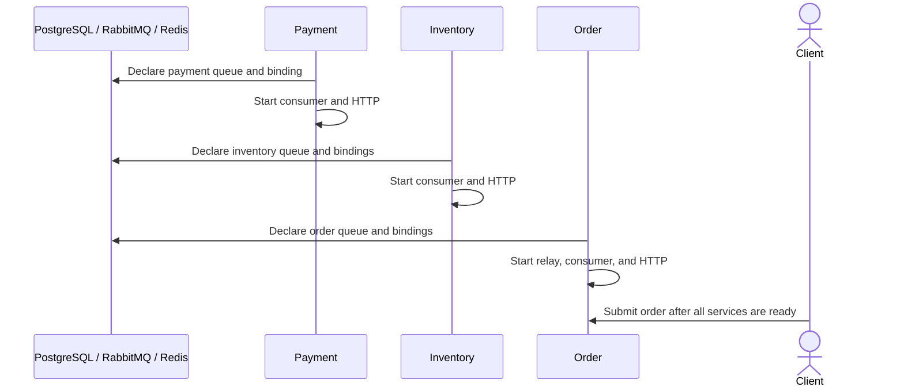

Recommended order: **Payment → Inventory → Order**.

## 11. Reliability boundaries

| Boundary | Implemented guarantee | Remaining gap |
| --- | --- | --- |
| Order creation | Order, items, and outbox record are atomic | Broker delivery is not confirmed |
| Inventory reservation | All items reserve or all roll back | Outcome publication is outside the transaction |
| Payment | Unique payment per `orderId` | Payment write and event publication are not atomic |
| Order outcome | Status and processed marker are atomic | Order can confirm before inventory commit |
| Technical error | Logged and dead-lettered | No retry/backoff stage |
| Post-payment inventory failure | Inventory event enters DLQ | No payment refund/order reversal |
| Abandoned reservation | Reservation remains stored | No expiry/reaper |
| Traceability | Correlation ID propagates in headers | Some error logs omit correlation/order IDs |

## 12. Code map

| Behavior | Source |
| --- | --- |
| Correlation-ID middleware | [`order-service/src/app.js`](../order-service/src/app.js#L21-L30) |
| Order request and `202` | [`orderController.js`](../order-service/src/controllers/orderController.js#L7-L45) |
| Order/outbox transaction | [`orderService.js`](../order-service/src/services/orderService.js#L8-L56) |
| Outbox relay | [`outboxRelay.js`](../order-service/src/workers/outboxRelay.js#L24-L83) |
| Order outcome handler | [`orderConsumer.js`](../order-service/src/consumers/orderConsumer.js#L24-L71) |
| RabbitMQ order bindings | [`rabbitmq.js`](../order-service/src/config/rabbitmq.js#L18-L38) |
| Atomic reservation | [`inventoryService.js`](../inventory-service/src/services/inventoryService.js#L12-L59) |
| Release compensation | [`inventoryService.js`](../inventory-service/src/services/inventoryService.js#L66-L101) |
| Commit stock | [`inventoryService.js`](../inventory-service/src/services/inventoryService.js#L108-L137) |
| Inventory event routing | [`inventoryConsumer.js`](../inventory-service/src/consumers/inventoryConsumer.js#L25-L92) |
| Cache-aside | [`productCache.js`](../inventory-service/src/cache/productCache.js#L4-L47) |
| Payment decision | [`paymentService.js`](../payment-service/src/services/paymentService.js#L13-L47) |
| Payment event flow | [`paymentConsumer.js`](../payment-service/src/consumers/paymentConsumer.js#L26-L79) |

## One-line mental model

```text
HTTP creates PENDING Order + Outbox
  -> Inventory reserves
  -> Payment decides
  -> success confirms Order and commits Inventory
  -> failure fails Order and releases Inventory
  -> unexpected consumer errors go to the DLQ
```
